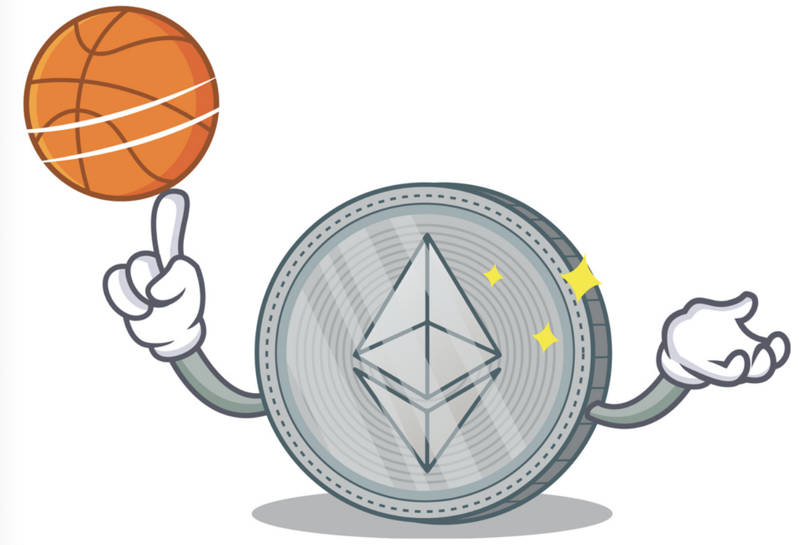

## VERSUS: Crypto-betting Game : 

A decentralized sports & event betting platform powered by Ethereum smart contracts.

Project 3_FinTech 2021

(Image by kongvector)

### Collaborators

- Coney Dacanay
- Jason Wang
- Kaining Liu
- Michael Nitchov
- Sherin Solomon
- Simran Saini

---

### Player 1 VERSUS Player 2: A Basketball Betting Game

***How it works***

***Setup***

- Tools:
    
    - Ganache
    - MyCrypto
    - Remix

- Network:

---

### Player 1: How to initiate a bet?

---

### Player 2: How to join a bet?

---

### How to receive winnings?

---

### Sources:
